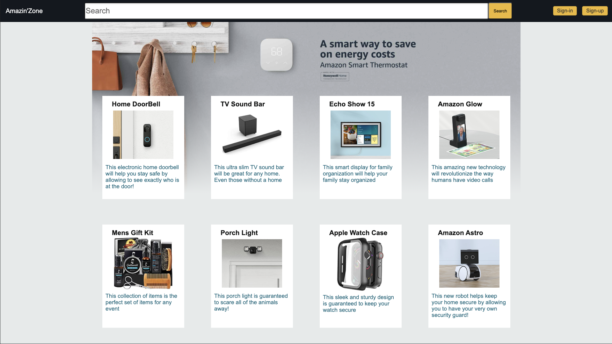
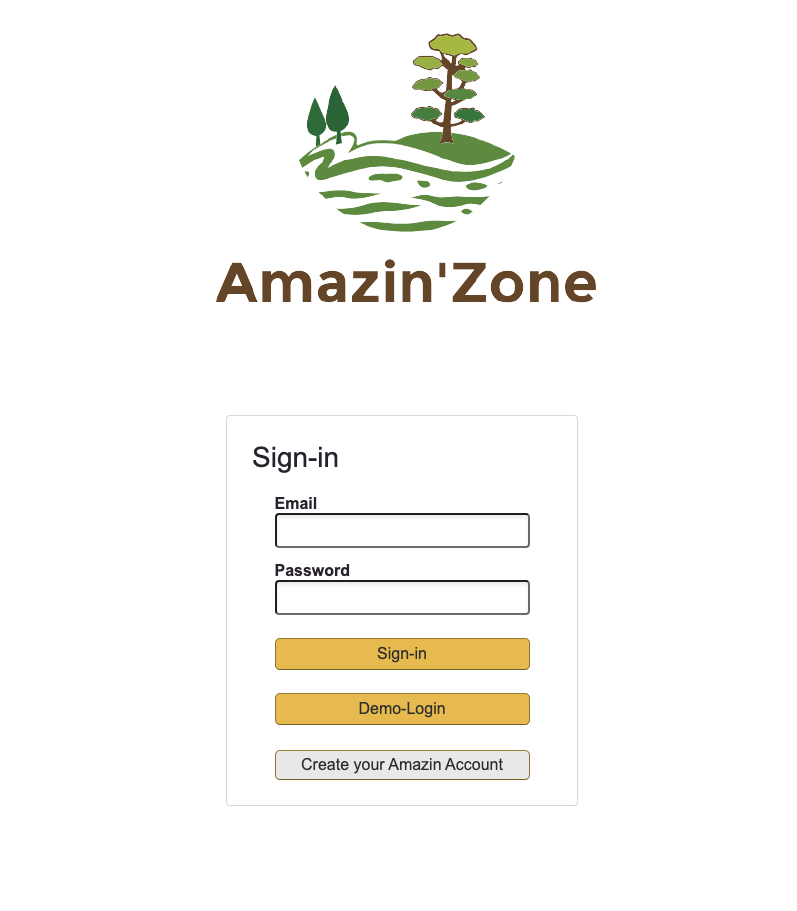
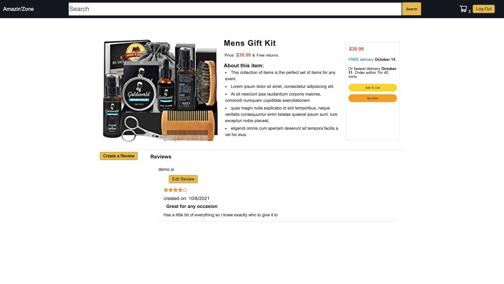
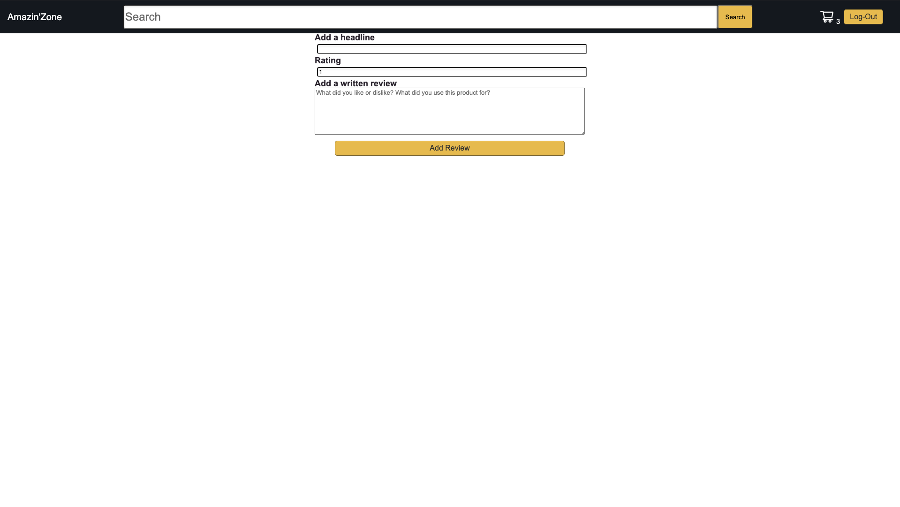
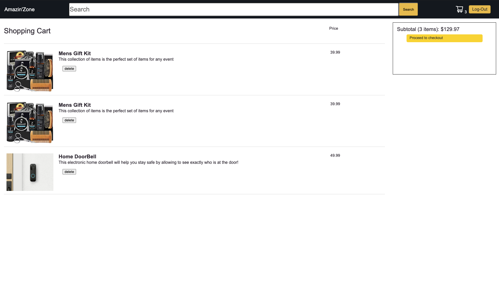
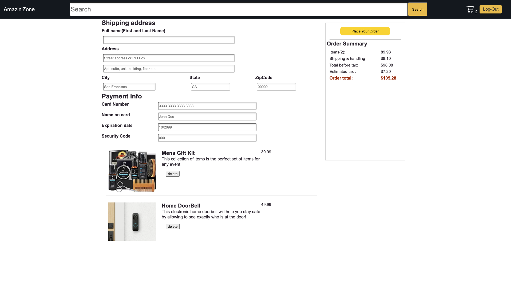

# README

## LIVE SITE
https://amazon-clone-tz.herokuapp.com/

## Description
 Amazin-Zone is a clone of the popular website Amazin.com . It is made with the Create/Read/Update/Delete functionality on Review and Cart as well as User Authentication
 
 
## Technology used

* Frontend: React/Redux
* Backend: Ruby on rails, PostgresSQL, AWS

# Key Features

## User Authentication
  
   
  
  * Users can Sign Up / Sign In / Sign Out their account
  * There is a demo user button for those who wish to use a premade account

## Search

* On the top of the page, there is a search bar that will take in a string. This string will then be matched with all item's title and descriptions. It will then go to a new index page with all of the items that match with the query string. 
  
## Reviews
  
  
  * Users can add a review to a product when they are logged in. If someone tries to add a Review without being logged in then it will redirect them to the login page
  * From there, the user can choose to login with an account or to use the demo account. 
  * Once a review has been added to a product, a list of reviews will be shown in the product show page. 
 
  * If the user logged in is the owner of the review, a button will show up which would allow the user to edit the review.
  * Once inside the Edit page, the user can change whatever they want about the review as well as delete the review entirely

## Cart
 
 
 
* Once a user has logged in, they would be able to see how many items are in their cart on the top right and be able to go into their cart by clicking the cart icon
* Once inside the Cart Show page, they are able to see the total cost of their cart before tax and shipping as well as able to delete any items they no longer want.
* From here they can go to the checkout page to see their total cost of tax and shipping included.
* They could then checkout their cart which will clear their cart. 

